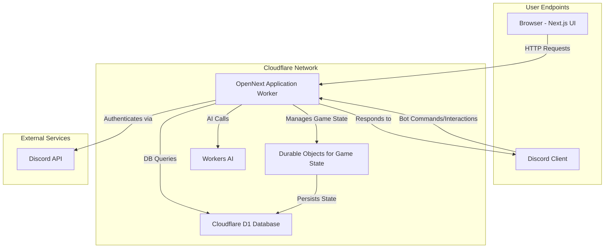

# Application Architecture

This document outlines the architecture for the Cepheus Engine Online platform. It is designed to be a scalable, cost-effective, and real-time system for playing tabletop RPGs online, with deep integration into Discord.

## Core Technologies

- **Framework**: Next.js with OpenNext (running on Cloudflare Workers)
- **Database**: Cloudflare D1 with Drizzle ORM
- **Authentication**: Discord OAuth via NextAuth.js
- **Real-time Engine**: Cloudflare Durable Objects
- **AI Game Master**: Cloudflare Workers AI

## Architectural Diagram

## System Breakdown

### 1. Application Framework (Next.js with OpenNext)

- The entire application is a monolithic Next.js project adapted for Cloudflare using the OpenNext library. This includes the UI, backend API, and Discord bot logic.
- OpenNext compiles the Next.js application into a single Cloudflare Worker, allowing for server-side rendering, API routes, and static file serving from a unified deployment.
- This architecture simplifies development and deployment while leveraging the performance of Cloudflare's global network.

### 2. Authentication (Discord OAuth)

- Users log in via Discord using NextAuth.js.
- An API route at `/api/auth/[...nextauth]` handles the OAuth2 handshake with Discord's API.
- Upon successful authentication, a session is created, and the user's Discord ID and profile information are stored in the `users` table, as defined by the Drizzle adapter schema.

### 3. Real-time Game State (Durable Objects)

- Each active game session (e.g., a specific game board or combat instance) will be managed by a unique Durable Object.
- Durable Objects are ideal for this use case because they provide a single-threaded, stateful context that can be accessed globally, solving many complexities of managing real-time multiplayer state.
- The Durable Object will hold the current state of the game in memory (e.g., piece positions, initiative order) and persist it to the D1 database periodically or when critical events occur.

### 4. Discord Bot Integration

- The Discord "bot" is not a separate, long-running process. Instead, it consists of API routes within the Next.js application that handle interactions from Discord.
- The primary endpoint at `/api/discord/webhook` receives all interactions (like slash commands) from Discord.
- It processes commands (e.g., `/roll`, `/character`), interacts with the main API logic and D1 database, and sends responses back to Discord.
- This allows players to interact with the game from within Discord, providing a seamless experience.

### 5. Ruleset & AI Engine

- The game's rules, provided in the `data` directory as JSON files, will be seeded into the `rulesets` table in the D1 database.
- When a game is created, it will be linked to a specific ruleset.
- The AI Game Master, powered by Cloudflare Workers AI, will use the ruleset data in conjunction with Large Language Models to make decisions, generate narrative content, and respond to player actions.
