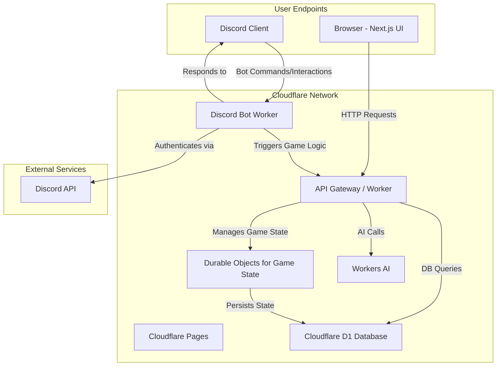

# Application Architecture

This document outlines the architecture for the Cepheus Engine Online platform. It is designed to be a scalable, cost-effective, and real-time system for playing tabletop RPGs online, with deep integration into Discord.

## Core Technologies

- **Frontend**: Next.js (hosted on Cloudflare Pages)
- **Backend API**: Cloudflare Workers
- **Database**: Cloudflare D1 with Drizzle ORM
- **Authentication**: Discord OAuth
- **Real-time Engine**: Cloudflare Durable Objects
- **AI Game Master**: Cloudflare Workers AI
- **Discord Bot**: Cloudflare Workers

## Architectural Diagram

## System Breakdown

### 1. Frontend (Next.js on Cloudflare Pages)

- The user interface is a Next.js application, providing a rich, interactive experience for character creation, viewing game boards, and managing games.
- It will be statically generated where possible and hosted on Cloudflare Pages for fast global delivery.
- The frontend authenticates with the backend by redirecting to a Discord OAuth flow, managed by a Cloudflare Worker. After authentication, a secure, HTTP-only cookie is used to manage the user's session.

### 2. Backend (Cloudflare Workers)

- A primary Cloudflare Worker will serve as the main API for the Next.js application. It will handle:
  - Data requests (e.g., fetching character sheets, game data).
  - Executing game logic.
  - Interacting with the D1 database via Drizzle ORM.
  - Delegating real-time game state management to Durable Objects.

### 3. Authentication (Discord OAuth)

- Users will log in via Discord.
- A dedicated Worker endpoint will handle the OAuth2 handshake with Discord's API.
- Upon successful authentication, a session is created, and the user's Discord ID and profile information are stored in the `players` table.

### 4. Real-time Game State (Durable Objects)

- Each active game session (e.g., a specific game board or combat instance) will be managed by a unique Durable Object.
- Durable Objects are ideal for this use case because they are single-threaded, stateful instances that can be accessed globally. This solves many of the complexities of managing real-time multiplayer state.
- The Durable Object will hold the current state of the game in memory (e.g., piece positions, initiative order) and persist it to the D1 database periodically or when critical events occur.

### 5. Discord Bot

- A separate Cloudflare Worker will handle interactions from the Discord bot.
- It will process slash commands (e.g., `/roll`, `/character`) and interact with the main API worker or directly with the D1 database to fetch information and update game state.
- This allows players to interact with the game from within Discord, providing a seamless experience.

### 6. Ruleset & AI Engine

- The game's rules, provided in the `data` directory as JSON files, will be seeded into the `rulesets` table in the D1 database.
- When a game is created, it will be linked to a specific ruleset.
- The AI Game Master, powered by Cloudflare Workers AI, will use the ruleset data in conjunction with Large Language Models to make decisions, generate narrative content, and respond to player actions.
